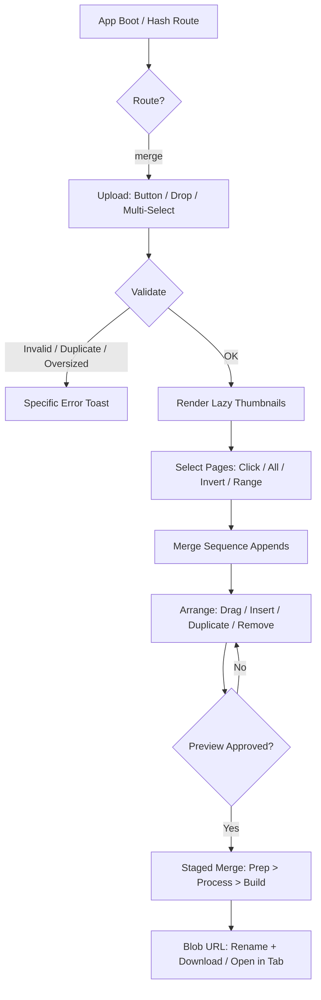
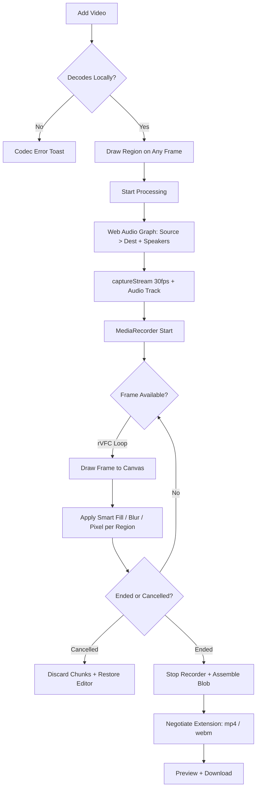

<h1 align="center">ANTROR TOOLS</h1>
<h3 align="center">Zero-Upload File Toolkit — Runs Entirely in the Browser</h3>

<p align="center">
  A lightweight, serverless collection of everyday file tools built on one principle: your files never touch a server. Merge PDFs with full page-level arrangement, erase image watermarks with diffusion inpainting, and clean static video watermarks frame-by-frame — all processed locally with vanilla JavaScript. No accounts, no uploads, no backend.
</p>

<p align="center">
  
  
  
  
  
</p>

---

## The Mission: Files That Never Leave the Device

Standard online file tools — PDF mergers, watermark removers, converters — all share the same architecture: your file is uploaded to someone else's server, processed there, and sent back. That means privacy risk, upload queues, file size limits, and a company that technically handled your legal, financial, or personal documents.

ANTROR Tools inverts the model. Every tool runs inside the browser sandbox using local compute: PDF.js renders pages, pdf-lib assembles documents, the Canvas API performs inpainting, and MediaRecorder re-encodes video on-device. The server count is zero — because zero are needed.

The flagship module is a **PDF Merger built like a lightweight document editor**, not a basic upload utility. It gives users exact control over *which* pages from each PDF enter the final document and *exactly* where they appear — then an Image and a Video Watermark Remover join the suite under the same design system and the same privacy guarantee.

| Module | Route | Input → Output |
|---|---|---|
| **PDF Merger** | `#/merge` | Multiple PDFs → single PDF, exact page order |
| **Image Watermark Remover** | `#/image-watermark` | JPG / PNG / WebP → cleaned PNG / JPG |
| **Video Watermark Remover** | `#/video-watermark` | MP4 / WebM → cleaned MP4 / WebM |

---

## Features & Engineering Decisions

### PDF Merger

* **Decoupled Selection ⇄ Sequence Data Model:** 
  The most important architectural decision in the app. Per-document selection state (`Set` of page numbers) is stored *separately* from the final merge order (an array of `{docId, pageNumber}` entries). Selecting a page appends it to the sequence; dragging rows, duplicating, inserting, or removing only ever touches the sequence — never selection. This separation is what makes interleaved orders like `A-1, B-4, A-7, C-1` and intentional page duplication safe and predictable.
* **Full Page Arrangement Engine:** 
  A custom pointer-based sortable handles both mouse and touch with edge auto-scroll, a dragged ghost, and a drop placeholder. Rows support insert-before/after from any loaded document, duplication (for repeated forms), and removal — where removing from the sequence never mutates the original PDF. Keyboard alternatives (`Alt+↑/↓`, `Home`, `End`, `Delete`) mirror every drag operation.
* **Range DSL with Adversarial Validation:** 
  The range parser accepts `1-3, 7, 10-12` and rejects every failure mode with a specific, human message — reversed ranges get a correction suggestion (`5-2` → "try 2-5"), out-of-bounds pages report the document's real page count, and garbage tokens are quoted back. No generic errors anywhere.
* **Lazy Thumbnail Pipeline:** 
  An `IntersectionObserver` queues renders only for pages near the viewport, drained by a bounded queue (max 5 concurrent renders). Results cache per page/zoom, device-pixel-ratio caps degrade automatically above 150 and 300 total pages, and a canvas pixel ceiling prevents memory exhaustion on huge documents. S/M/L zoom re-renders only what's visible.
* **Snapshot-Based Undo/Redo:** 
  Every mutation calls `History.capture()` first, pushing a lightweight snapshot of order + selection + sequence (capped at 100 steps). `Ctrl+Z` / `Ctrl+Y` restore any workspace action — including "Undo" for deleting an entire uploaded PDF via a toast action.
* **UI-Thread-Yielding Merge:** 
  The merge loop copies one page at a time and yields via `requestAnimationFrame`, so a 300-page merge never freezes the tab. Progress runs through visible stages (Preparing → Processing → Building) with per-stage metrics and a working Cancel button.

### Image Watermark Remover

* **Smart Fill (Diffusion Inpainting):** 
  Marked regions aren't just blurred — they're reconstructed. Each region initializes from a bilinear blend of its surrounding boundary pixels, then runs iterative diffusion passes until the fill settles. Computation happens on a downscaled copy (160k px working cap) since the result is smooth, making the upscale invisible while keeping large regions fast.
* **Three Removal Modes, One Engine:** 
  Smart fill for plain/soft backgrounds, blur (downscale-upscale inside a clip), and pixelate — switchable per session before running. All modes operate through the same clamped-rect pipeline.
* **Normalized Region Editor:** 
  Boxes are stored as percentage coordinates, so regions survive any canvas size or zoom. Users draw unlimited boxes, delete individual boxes via a hover control, undo the last box, or cancel a half-drawn box with `Esc`.

### Video Watermark Remover

* **Real-Time Frame Pipeline:** 
  No frame extraction, no ffmpeg.wasm payload. The video plays through once while a `requestVideoFrameCallback` loop (with `requestAnimationFrame` fallback) draws each frame to a canvas, applies the chosen fill mode to every marked region, and pushes the canvas into `captureStream(30)`. MediaRecorder records the cleaned stream directly.
* **Zero-Copy Audio Graph:** 
  A Web Audio `MediaElementSource` routes the source video's audio to both a `MediaStreamDestination` (mixed into the recording) and the speakers (preview stays audible) — so the output keeps its original audio track without a second decode pass.
* **Codec Negotiation:** 
  A `MediaRecorder.isTypeSupported` cascade prefers H.264 MP4 and falls back through VP9/VP8 WebM. The file extension follows the negotiated mime, so users never receive a mislabeled file.
* **Honest Cost Model:** 
  On-device re-encoding runs in real time by design — a 2:00 video takes ~2:00 to process. The app states this up front, confirms before processing videos over 2:30, streams live progress with a time counter, and supports mid-run cancellation that discards cleanly.
* **Memory Hygiene:** 
  Object URLs for sources and results are tracked and revoked on replace/reset, recorder chunks are released after blob assembly, and the audio context is created once per element and reused.

### Platform Core

* **Hash Router SPA Without a Framework:** 
  Deep links (`#/merge`, `#/image-watermark`, `#/video-watermark`), working browser back button, per-route document titles, and route-scoped chrome (undo/redo buttons and the status bar only exist on the merger route). Navigating away and back preserves the entire merger workspace.
* **Scoped Interactions:** 
  Global keyboard shortcuts (`Ctrl+O`, `Ctrl+A`, `Ctrl+Z`) and the window-level file drop target only activate while the merger route is active — preventing cross-tool accidents like dropping a video into a PDF workspace.
* **Theme Persistence Without Flash:** 
  An inline pre-paint script reads the stored theme from `localStorage` and applies it before first render, eliminating the light/dark flash on load. It's the only key the app ever stores.
* **Single Ordered File, Zero Build Step:** 
  All logic lives in one `app.js` whose sections are ordered by dependency — helpers → router → merger → media engine → tools → boot — so the entire platform runs as plain `<script>` tags with no bundler, transpiler, or package manager.

---

## Architecture

GitHub natively supports Mermaid.js diagrams. Below is the visual map of the platform router and the two most complex processing pipelines:

**PDF Merge Pipeline**



**Video Watermark Processing Pipeline**



---

## How to Deploy and Use

This application is 100% client-side with no build step. Deploy by pushing the repository to GitHub and importing it into Vercel, Netlify, or GitHub Pages — or just open `index.html` directly in a browser.

```text
antror/
├── index.html          # shell: router targets, all tool views, legal footer
├── css/
│   └── style.css       # design tokens (light/dark) + all component styles
└── js/
    └── app.js          # entire platform, dependency-ordered in one file
```

> The two PDF libraries and fonts load from CDNs on first load. For fully offline use, download `pdf.min.js`, `pdf.worker.min.js`, and `pdf-lib.min.js` into a `vendor/` folder and update the three references.

### 1. PDF Merger
1. Open `#/merge` and add PDFs via the button or drag & drop.
2. Select pages by clicking thumbnails, using **All / Invert / Clear**, or typing ranges like `1-3, 7, 10-12` under **Range…**
3. Arrange the **Merge Sequence** panel: drag rows into the exact final order, or use the row actions to insert, duplicate, or remove pages.
4. Hit **Preview** to review the full planned order, then **Merge PDFs**.
5. Rename the output if needed and download — the final PDF contains exactly the shown pages in exactly the shown order.

### 2. Image Watermark Remover
1. Open `#/image-watermark` and add a JPG, PNG, or WebP.
2. Drag a box over each watermark — as many boxes as needed.
3. Choose a mode: **Smart fill** (reconstructs the background), **Blur**, or **Pixelate**.
4. Click **Remove watermark**, compare Original vs Cleaned, then download.

### 3. Video Watermark Remover
1. Open `#/video-watermark` and add an MP4 or WebM.
2. Pause on any frame and drag a box over the static watermark.
3. Click **Remove watermark** — processing plays the video once in real time (~the video's own duration) with live progress.
4. Preview the cleaned result and download as MP4 (or WebM, depending on your browser's encoder). Audio is preserved.

### Session Management
* **Undo / Redo:** `Ctrl+Z` / `Ctrl+Y` revert any merger action, including PDF removal and clearing the workspace.
* **Clear All:** wipes all uploads and selections after a confirmation — original files on disk are never touched by any tool.
* **Theme:** the sun/moon toggle persists between visits.

---

## Tech Stack

* **PDF.js (Mozilla):** Local rendering of PDF pages to canvas thumbnails, with lazy loading and per-zoom caching.
* **pdf-lib:** Serverless PDF assembly — pages are copied one-by-one into a new document in exact sequence order, supporting interleaving and duplication natively.
* **Canvas 2D API:** Diffusion-inpainting "smart fill", clipped blur, and pixelate modes for both image and per-frame video processing.
* **MediaRecorder + captureStream:** Real-time on-device video re-encoding with a negotiated H.264/VP9/VP8 codec cascade.
* **Web Audio API:** MediaElement source graph that preserves the original audio track in recorded output while keeping preview audible.
* **Vanilla JavaScript:** Zero frameworks. The router, history engine, sortable, inpainting pipeline, and all three tools are raw, dependency-ordered JS.
* **Vanilla CSS:** Custom light/dark design system with CSS variables, `color-mix()` translucent chrome, and responsive layouts.
* **Web APIs:** `IntersectionObserver` (lazy thumbnails), Pointer Events (touch drag), `localStorage` (theme key only — never file data).
````

